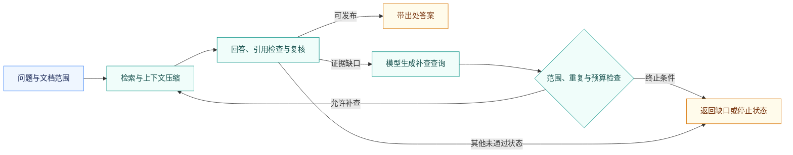

<div align="center">

# Financial Research Agent

### 面向金融长文本的证据推理 Agent

从长文档中找到证据，在有限上下文中完成推理，让答案有据可查。

[](pyproject.toml)
[](.env.example)
[](#competition)

[项目背景](#background) · [核心特性](#features) · [示例](#example) · [工作流程](#workflow) · [快速开始](#quickstart) · [使用文档](docs/usage.md)

</div>

---

**Financial Research Agent** 是一个面向金融长文档问答的证据推理项目。它围绕多文档检索、上下文压缩与条款辨析组织证据，并通过模型驱动的定向补查和来源核验，将回答与原文关联起来。

<a id="competition"></a>

> **赛事成绩｜AFAC 2026 赛题四 B 榜第 35 名**
>
> 项目相关团队参赛方案取得上述成绩。本仓库整理核心组件与 Agent 工程扩展。

<a id="background"></a>

## 为什么做这个项目

金融年报、合同与保险条款中，回答问题所需的信息往往分散在不同文档和段落里。看似相同的表述，可能因适用主体、时间范围或例外条件不同而得出相反结论；把全文直接交给模型，又会带来大量冗余上下文与 Token 开销。

[AFAC 2026 赛题四「金融长文本 Agent 的动态记忆压缩与高效问答挑战」](https://tianchi.aliyun.com/competition/entrance/532486)聚焦这些问题：在有限 Token 消耗下，完成金融长文档理解、证据检索、跨文档比较与条件推理。

本项目沿着三个问题展开：**证据在哪里？哪些内容值得保留？当前证据足够回答吗？**

<a id="features"></a>

## 核心特性

- **找全证据，而不只追求片段相关。** 原方案采用 Doc-first 分层检索与 BM25F-lite 字段加权，结合逐文档证据保底，处理全局 Top-K 集中于少数文档的问题。
- **逐项辨析，而不混淆相似条款。** 原参赛方案围绕候选选项组织独立查询与证据窗口，逐项核对主体、限定条件和例外，再聚合答案。
- **压缩上下文，保留可回查的原文。** 按关键词与数值加权选择连续文本窗口，结合去重、字符预算分配和实际 Token 统计组织输入。
- **证据不足时，进行受限补查。** 模型提出定向查询，程序检查范围、重复与预算；保留旧证据并追加新片段，再次回答与复核。可选 `doc_id / span_id` 来源绑定，输出 Markdown 报告与 JSON 记录。

当前 `answer` 入口在指定文档范围内运行；原全库盲检组件与逐选项参赛流程保留为来源能力，不等于已完整迁入默认入口。另提供受支持年度财报的[来源绑定与确定性计算工具](docs/financial-workflow-2026-09-14.md)。

<a id="example"></a>

## 一个例子：相似条款，不同结论

> **问题：** 比较甲乙合同的提前终止通知期限及例外条件。

仓库内置两份虚构合同的简短摘录，可直接运行检索与压缩，无需比赛数据或 API 密钥：

| 来源 | 通知期限 | 原文中的例外条件 |
| :--- | :--- | :--- |
| `example_contract_a` · 第 1 页 | 提前 **30 日**书面通知 | 发生约定重大违约时，不受该通知期限限制 |
| `example_contract_b` · 第 1 页 | 提前 **15 日**书面通知 | 本示例条款未另列通知期限的例外 |

**如何解读：** 两份合同的一般通知期限不同；甲合同还明确规定了重大违约例外。乙合同的这段摘录未列出例外，并不等于整份合同一定不存在其他例外。

这正是项目关注的区别：既找到“30 日”和“15 日”，也保留改变结论的条件与证据范围。若证据不足，则进入补查或返回缺口，而不是把缺少信息直接当作否定结论。

*上表及解读为基于[合成示例](data/example/chunks.jsonl)整理的说明，不冒充模型实测输出。下面的快速开始会实际返回两处原文证据；完整模型问答需显式启用 Qwen。*

<a id="workflow"></a>

## 工作流程



默认文本问答流程示意，财务工具分支见[详细设计](docs/core-research-2026-09-14.md)。补查保留旧证据并追加新片段；默认最多一次，重复查询、无新增证据或预算耗尽时停止。

<a id="quickstart"></a>

## 快速开始

### 1. 安装

建议使用 **Python 3.12 + Linux / WSL**。

```bash
git clone https://github.com/M1kasali/financial-research-agent.git
cd financial-research-agent
python3 -m venv .venv
source .venv/bin/activate
pip install -e ".[dev]"
```

仓库当前为私有，克隆需要访问权限。

### 2. 运行上面的合同示例

```bash
financial-agent prepare \
  --chunks data/example/chunks.jsonl \
  --query '比较甲乙合同的提前终止通知期限及例外条件' \
  --doc example_contract_a --doc example_contract_b
```

返回结果节选：

```json
{
  "status": "prepared",
  "candidate_count": 2,
  "selected_window_count": 2,
  "rendered_chars": 238,
  "model_calls": 0,
  "answer_generated": false
}
```

完整输出还包含原文窗口、文档 ID、页码与来源哈希。此步骤只检索和压缩，不调用模型。

### 3. 体验离线问答流程

```bash
python scripts/run_core_answer_smoke.py
```

通过合成材料和预设模型响应，演示提取、拒答、澄清、计算转交、引用失败、预算终止与复核不通过七种情况。脚本禁用网络，生成的 Markdown / JSON 保存于 `experiments/runs/`；它检验程序流程，不衡量模型准确率。

<details>
<summary><strong>接入自己的文档与 Qwen</strong></summary>

1. 按照 [JSONL 示例](data/example/chunks.jsonl)组织有权使用的文档分块，放入 `data/local/`。
2. 将 `.env.example` 复制为 `.env`，填写自己的密钥。
3. 通过 `financial-agent catalog --chunks YOUR_CHUNKS.jsonl` 查看文档 ID，先用 `prepare` 检查证据。
4. 通过 `financial-agent answer --help` 查看问答参数。仅显式传入 `--execute` 与新的 `--output-dir` 才会读取密钥并请求模型。

当前 CLI 使用 `qwen3.7-flash` 和配置的官方 Qwen 端点。在线执行会发送问题及选中证据，并产生模型费用；请确认数据权限与账号可用性。详细配置、预算和引用模式见[使用指南](docs/usage.md)。

</details>

## 验证与文档

**本地离线回归：502 项通过**（2026-09-16）。首次发布同时检查了干净代码副本和安装后的打包产物，验证方式见[发布检查记录](docs/publication-checklist.md)。

```bash
python -m pytest -q
ruff check src tests scripts
```

| 想了解什么 | 文档 |
| :--- | :--- |
| 如何安装、接入文档、启用模型 | [使用与运行指南](docs/usage.md) |
| 补查如何触发、如何停止 | [计算与补查闭环](docs/core-research-2026-09-14.md) |
| 引用如何映射回原文 | [原文片段 ID](docs/citation-spans-2026-09-14.md) |
| 原参赛组件如何迁入 | [核心接入与来源核查](docs/v45-core-integration-2026-09-14.md) |
| 已做过哪些真实开发实验 | [小规模闭环对照](docs/core-comparison-2026-09-14.md) · [引用模式对照](docs/live-citation-comparison-2026-09-14.md) |

<details>
<summary><strong>项目结构</strong></summary>

```text
financial-research-agent/
├── src/financial_agent/   # 检索、问答、补查、计算与核验
├── vendor/               # 原团队算法组件
├── tests/                # 离线测试
├── data/example/         # 合成示例
├── scripts/              # 演示与实验辅助脚本
├── configs/              # 配置示例
└── docs/                 # 设计、使用和验证记录
```

</details>

## 项目状态与来源

这是一个可运行的研究原型。比赛成绩对应原团队参赛方案；后续补查、工具与引用扩展有独立开发记录，尚不代表完整最高分复现或独立准确率评测。

仓库不包含密钥、比赛原始材料和完整历史运行记录。结构化事实记忆与通用自主规划不作为已完成能力；完整使用边界见[使用指南](docs/usage.md)。

团队代码来源及公开前的授权事项见 [NOTICE.md](NOTICE.md)。目前仓库保持私有，尚未授予开源许可证。

---

<div align="center">
<sub>以证据组织上下文，以来源支撑结论。</sub>
</div>
